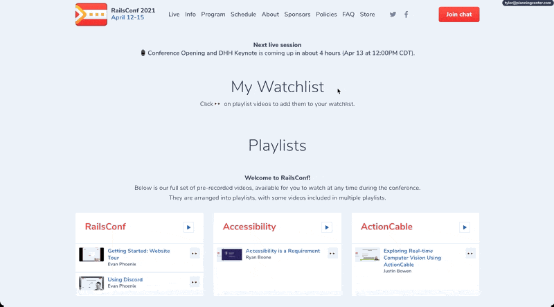

# RailsConf 2021 Watchlist

## Chrome Extension

Add this chrome extension to easily save videos from the playlist to "My Watchlist".

### How?

- Adds custom script/styles to the `https://railsconf.org/live` page only
- Saves watchlist video data in the browser's local storage

### Demo

### Installation

I'm opting not to add to this to the Chrome Web Store as it's a transient quick-n-dirty tool.
There's an easy way to add this extension manually.

1. Clone this repository or download the ZIP
2. Go to the "Extensions" page in your chrome-based browser
3. Toggle the "Developer mode"
4. Click the "Load unpacked" button and point it towards this repository's folder
